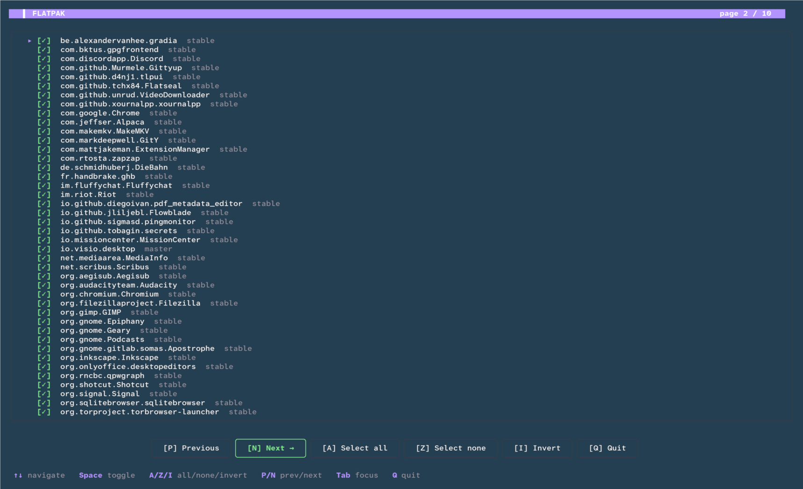

# reliure
Format, Reinstall, Restore. A new clean system every 6 months.

> **reliure** \\ʁə.ljyʁ\\ *féminin*  
> French, binding (the spine of a book where the pages are held together)

---

**Reliure** scans your Linux system, builds a YAML list of everything installed (apt packages, flatpaks, snaps, VS Code extensions, GNOME Shell extensions, pip / pipx / cargo / npm packages, `go install`-ed binaries, locally-pulled Ollama models, AppImages, saved Wi-Fi & VPN connections, GNOME settings, plus clues from your shell history and manual installs), and lets you reinstall it on a fresh system through a slick interactive picker.

It's a single static binary built in Go.



## Install

```bash
curl -sSfL https://raw.githubusercontent.com/benjaminbellamy/reliure/main/install.sh | sh
```

Drops the latest `linux/amd64` binary into `/usr/local/bin/` (one sudo prompt). Both `reliure` and `sudo reliure` work afterward — the latter is needed for the wifi/vpn scanners. If sudo isn't available, the installer falls back to `~/.local/bin/` and warns that `sudo reliure` won't be on PATH.

### Highlights

- **Single static binary** (~6 MB, `linux/amd64`). No Python, no `dialog`, no `whiptail`, no curl-piped scripts on the new system.
- **Slick TUI** built on the Charm stack (Bubble Tea + Bubbles + Lip Gloss). Multi-page wizard, six labelled buttons, all keyboard-driven, with a `back` option from every confirmation.
- **Smart scanning**: picks up apt, flatpak, snap, VS Code, GNOME Shell extensions, pip / pipx / cargo / npm, `go install`-ed binaries, locally-pulled Ollama models, AppImages, saved Wi-Fi & VPN connections (with `sudo`), GNOME dconf settings, and inference sources (shell history + manual installs in `/opt`, `/usr/local/bin`, `~/.local/bin`, third-party APT repos, runtime fingerprints).
- **OS-vs-user diff**: packages that arrived with the original Ubuntu install are flagged `[os]` (heuristic: `/var/log/installer/*` mtime ± dpkg.log burst detection) so you can focus on what *you* added.
- **Printable HTML report**: `reliure report <snapshot.yaml>` emits a styled standalone HTML — open in a browser and Cmd/Ctrl-P → Save as PDF.

---

## ⚠ Sensitive data in snapshots

When you scan with `sudo` to include `wifi` and `vpn` sources, reliure embeds the full `.nmconnection` text — **including pre-shared keys, VPN passwords, and certificates** — into the snapshot YAML, base64-encoded under a `payload:` field per entry. The encoding makes the file readable but **does not encrypt anything**: anyone with the YAML can recover the secrets.

When wifi/vpn are present in your snapshot:

- Treat the YAML like an SSH private key. Mode 600. Don't commit it to a public repo.
- Restore writes each file back as `/etc/NetworkManager/system-connections/<id>.nmconnection`, mode 600 root, then runs `sudo nmcli connection reload` once.
- To skip these sources at scan time, run **without sudo** — wifi/vpn skip cleanly with a one-line "needs root" hint, every other scanner runs normally. Or pass an explicit source list: `reliure backup --source apt --source flatpak --source snap …`.

The `apt`, `flatpak`, `snap`, `vscode`, etc. sources are unprivileged and never carry secrets.

`sudo reliure backup` is supported: reliure runs the wifi/vpn scanners as root first, then drops back to `$SUDO_USER` (re-setting `HOME`, `USER`, and prepending `~/.cargo/bin`, `~/.local/bin`, `~/go/bin`, etc. to `PATH`) before the user-space scanners run — so `code`, `cargo`, `pipx`, the history files, and the rest behave correctly.

---

## How to use it

The full clean-reinstall workflow (assumes you've already [installed](#install) reliure above):

1. **Run the backup:**

    ```bash
    reliure
    ```

   The system gets scanned, you walk through a multi-page checkbox picker (one page per source: apt, flatpak, snap, vscode, gnome-ext, pip, pipx, cargo, npm, go binaries, ollama models, appimages, wifi networks, vpn connections, plus an "inferred" review page), and a YAML snapshot lands in `~/.config/reliure/snapshots/reliure-YYYYMMDD.yaml`. Optionally a `reliure-gnome-YYYYMMDD.dconf` is dumped into `~/Documents/`.

2. **Back up your data** with whatever tool you usually use (DéjaDup, Borg, rsync, …). Make sure `~/Documents/` and `~/.config/reliure/` are included so the snapshot and dconf file go with it.

3. **Format and reinstall** Ubuntu (or your derivative).

4. **Restore your data backup**, again with your usual tool.

5. **Reinstall reliure on the new system** (re-run the install one-liner from above), then run the restore:

    ```bash
    reliure restore ~/.config/reliure/snapshots/reliure-20260426.yaml
    ```

   The picker reopens — this time with everything **unchecked by default**. You tick what you want, hit `[Apply ✓]`, confirm, and reliure runs the install commands. Items already installed at the snapshot's version are tagged `[installed]` and silently skipped; items at a different version show `[installed: X]` so you can choose to upgrade.

You have a brand new clean computer.

---

## The picker

Built on the Charm stack (Bubble Tea + Bubbles + Lip Gloss). Multi-page wizard, one page per source, with the section name as a high-contrast colored bar at the top of each page and a `page X / Y` counter right-aligned on the same bar.

**Keys (work regardless of which control is focused):**

| Key                | What it does                                  |
|--------------------|-----------------------------------------------|
| `↑` / `↓` (`k`/`j`)| navigate items                                |
| `PgUp` / `PgDn`    | scroll a page at a time                       |
| `Home` / `End` (`g`/`G`) | jump to top / bottom                    |
| `Space` / `Enter`  | toggle current item                           |
| `A`                | select **A**ll (current page)                 |
| `Z` / `0`          | select none (**Z**ero)                        |
| `I`                | **I**nvert selection                          |
| `P` / `←`          | **P**revious page                             |
| `N` / `→`          | **N**ext page (becomes `Apply ✓` on the last) |
| `Tab` / `Shift-Tab`| move focus between list and buttons           |
| `Q` / `Esc` / `Ctrl-C` | quit / abort                              |

**Buttons** (always visible, all clickable via `Tab` + `Enter`):

```
[P] Previous   [N] Next/Apply   [A] Select all   [Z] Select none   [I] Invert   [Q] Quit
```

**Item badges** appear next to each entry to tell you what's what:

| Badge              | Meaning                                                                  |
|--------------------|--------------------------------------------------------------------------|
| `[essential]`      | flagged in the YAML as essential                                         |
| `[os]`             | arrived with the original OS install (don't need to reinstall)           |
| `[installed]`      | already installed at the snapshot's version (restore-time only)          |
| `[installed: X]`   | installed at a *different* version — you may want to upgrade             |

Inferred entries (shell history + manual installs) live on a dedicated *"inferred (review carefully)"* page rather than carrying a per-item badge — they default off and are never auto-installed.

**Confirmation prompt** after the picker:

```
  Save snapshot with this selection?  [Y/n/b] (b = back to picker):
```

`b` re-opens the picker with your current ticks preserved — keep editing, no need to start over. The same `[Y/n/b]` prompt fires before installs on restore.

---

## CLI

```
reliure                          # interactive backup workflow (default)
reliure backup [flags]           # explicit alias for the default
reliure snapshot [flags]         # scan + write YAML, no picker, no installs
reliure restore <snapshot.yaml>  # picker + run installs
reliure report  <snapshot.yaml>  # render a styled HTML report (printable to PDF)
reliure list    <snapshot.yaml>  # styled table view of a snapshot
reliure diff    <a> <b>          # added/removed/changed between two snapshots
reliure version
```

**`backup` flags**

| Flag                        | What it does                                                  |
|-----------------------------|---------------------------------------------------------------|
| `-o, --output PATH`         | snapshot YAML path (default: `~/.config/reliure/snapshots/reliure-YYYYMMDD.yaml`) |
| `--source NAME`             | restrict to these scanners (repeatable)                        |
| `--no-include-inference`    | skip the history + manual-install scanners                    |
| `--exclude PATTERN`         | drop entries whose `id` matches the glob (repeatable)         |
| `--edit`                    | open the snapshot in `$EDITOR` after writing                  |
| `--no-tui`                  | skip the picker; keep everything scanned                      |
| `--no-gnome`                | skip the GNOME settings dump                                  |

**`restore` flags**

| Flag                  | What it does                                              |
|-----------------------|-----------------------------------------------------------|
| `--dry-run`           | print commands without executing                           |
| `--essential-only`    | non-interactive: install items flagged `essential: true`  |
| `--source NAME`       | restrict to these sources (repeatable)                     |
| `--no-gnome`          | skip the GNOME dconf prompt                                |
| `--gnome-file PATH`   | explicit dconf path                                        |
| `-y, --yes`           | skip the confirmation prompts (and the GNOME yes/no)       |

**`report` flags**

| Flag             | What it does                                              |
|------------------|-----------------------------------------------------------|
| `-o, --output PATH` | output HTML path (default: `./reliure-report-YYYYMMDD.html` in cwd) |

**`list` flags**

| Flag                | What it does                                          |
|---------------------|-------------------------------------------------------|
| `--source NAME`     | restrict to these sources (repeatable)                 |
| `--essential`       | show only items flagged essential                      |
| `--unverified`      | show only inferred / unverified items                  |
| `--os`              | show only items flagged as OS-installed                |
| `--user-only`       | hide OS-installed items (mutually exclusive with `--os`) |

---

## List & diff

Two read-only commands for inspecting snapshots without booting the picker.

**`reliure list`** prints a styled table grouped by source — handy for a quick sanity check after a scan, or to grep for a specific package by piping through `--no-color | grep`.

```bash
reliure list ~/.config/reliure/snapshots/reliure-20260509.yaml
reliure list snap.yaml --source apt --user-only      # apt only, hide [os]-tagged
reliure list snap.yaml --essential                   # only what you flagged essential
reliure list snap.yaml --unverified                  # only the inferred review pile
```

**`reliure diff`** compares two snapshots — typically yesterday's vs. today's, or pre-reinstall vs. post-restore — and shows added / removed / version-changed entries:

```bash
reliure diff ~/.config/reliure/snapshots/reliure-20260101.yaml \
             ~/.config/reliure/snapshots/reliure-20260509.yaml
```

Both commands read the YAML, run no installs, and require no privileges.

---

## Reports

`reliure report` turns a snapshot into a styled, standalone HTML document — useful as an archival artefact or a printable PDF.

```bash
reliure report ~/.config/reliure/snapshots/reliure-20260426.yaml
# → ./reliure-report-20260426.html
xdg-open reliure-report-20260426.html      # or just double-click
# Then Cmd/Ctrl-P → "Save as PDF" for a printable copy
```

Layout: a header with the date / host / OS / package counts, a two-column table of contents, one section per source with a name/version/tags table, and a footer with the GPL line. Light/dark adaptive. The print stylesheet hides the TOC, sets 1.8 cm page margins, and prevents row breaks across pages — Cmd/Ctrl-P → Save as PDF gives a clean PDF.

---

## What gets scanned

| Source            | How                                                                                                                               |
|-------------------|-----------------------------------------------------------------------------------------------------------------------------------|
| `apt`             | `apt-mark showmanual` (manually-installed only). Each package also gets `os_package: true` if it landed during the original OS install (signal: `/var/log/installer/*` mtime, cross-checked against the dpkg-log install burst). |
| `flatpak`         | `flatpak list --app`                                                                                                              |
| `snap`            | `snap list` (infrastructure snaps filtered)                                                                                       |
| `vscode`          | `code --list-extensions`                                                                                                          |
| `gnome-ext`       | `~/.local/share/gnome-shell/extensions/` and `/usr/share/gnome-shell/extensions/` — restore via the Extensions app (URL surfaced) |
| `pip`             | `pip list --user --format=json`                                                                                                   |
| `pipx`            | `pipx list --json`                                                                                                                 |
| `cargo`           | `cargo install --list`                                                                                                            |
| `npm`             | `npm list -g --depth=0 --json`                                                                                                    |
| `go`              | `go version -m` on each binary in `$GOBIN` (or `$GOPATH/bin`, default `~/go/bin`); restore re-runs `go install <path>@<version>` |
| `ollama`          | `ollama list` — locally pulled models; restore re-pulls each via `ollama pull <model:tag>`                                        |
| `appimage`        | `*.AppImage` files in `~/Applications/`, `~/.local/bin/`, `/opt/`. Manual re-download — restore prints filenames as a to-do list |
| `wifi`            | NetworkManager wifi profiles. Discovered via `nmcli -t -f NAME,TYPE,FILENAME,UUID connection show`, then each keyfile is read directly — handles both vanilla keyfile setups (`/etc/NetworkManager/system-connections/`) and Ubuntu's netplan-managed layout where the runtime files live in `/run/NetworkManager/system-connections/`. Root-only at scan time — without sudo, scanner emits `needs root — re-run with \`sudo\` to include networks` if any matching profile exists. Full file text (incl. PSK) base64-encoded into `payload:`. See [Sensitive data in snapshots](#-sensitive-data-in-snapshots). |
| `vpn`             | Same as `wifi`, for `type=vpn` (OpenVPN/PPTP/etc.) and `type=wireguard` connections. |
| GNOME settings    | `dconf dump /org/gnome/` (optional, prompted at backup time)                                                                      |
| shell history     | `~/.bash_history`, `~/.zsh_history` for install commands (`apt`, `snap`, `flatpak`, `pip`, `pipx`, `cargo`, `npm`, VS Code)        |
| manual installs   | `/opt/`, `/usr/local/bin/`, `~/.local/bin/`, `/etc/apt/sources.list.d/`, plus fingerprint dirs (`~/.nvm`, `~/.ollama`, `/etc/docker`, `~/.rustup`, `~/.deno`, `~/.bun`, `~/.pyenv`, …) |

History and manual results are flagged `unverified: true` — they appear on a separate review page in the picker, default off, **never auto-installed**.

---

## Build from source

Requires Go 1.23+.

```bash
git clone https://github.com/benjaminbellamy/reliure.git
cd reliure
go mod tidy
make build         # → ./bin/reliure
make build-static  # CGO-disabled, stripped — what release builds use
make test
```

The release pipeline (`.goreleaser.yaml`) builds the published `linux/amd64` binary on every `v*` tag push via GitHub Actions.

---

## License

Copyright (C) 2026 Benjamin Bellamy.

This program is free software: you can redistribute it and/or modify it under the terms of the [GNU General Public License v3 or later](LICENSE) as published by the Free Software Foundation.
